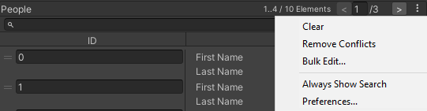
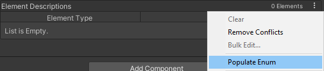
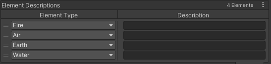
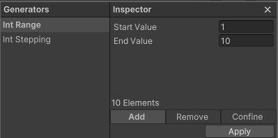

# Serialized Dictionary

## 本项目逐文件核查（2026-10-06）

当前 Assets 内副本 package.json 为1.0.0、声明 Unity 2021.3。已核查本 README、[三页原始手册](Readme.pdf)、[MIT 许可原文](LICENSE.md)、程序集与相关序列化/编辑器实现。保留 PDF、许可及其 meta；下方英文示例的 Confine 说明已按本地实现修正。

### 与原手册不同或需要限定的行为

- Editor 反序列化保留序列化列表中的重复/无效项，实际字典只采用首个有效键；null 值与 null 键不是同一概念。Player 分支逐项 Add，没有同样的重复/null 键容错；正常构建序列化会先过滤，但不能保证任意运行时输入安全。
- Confine **仅移除现有且不在生成集合内的有效键，不补齐缺失键**。原5..15、生成1..10时结果为5..10。PDF 的 Confine 示例与当前实现不符；PDF Remove 结果11..15正确，解释中“移除5..9”应为5..10。
- 此类型继承 Dictionary，部分修改接口以 new 隐藏。通过基类等入口修改时，Editor 的非空 backing list 不一定同步，随后反序列化可能覆盖这些改动。
- 存在重复键时 Remove 只删除一条序列化项，剩余项可能在下一次反序列化重新进入字典。自定义 comparer 也没有一致应用到全部 backing list/lookup/分组操作。

四张 README 本地示意图均存在；它们描述编辑器界面，不是本项目运行验证。当前 Scripts/Tests 未发现业务调用或专项测试，本轮未导入示例、执行批量编辑或验证 Player 构建。第三方原始手册的广泛能力描述应以上述 Editor/Player 边界为准。

Serialized Dictionary is designed to feel native to the Unity Editor while providing some additional functionality to speed up frequent workflows.

## Quick Start

Use the class `SerializedDictionary<,>` in the Namespace `AYellowpaper.SerializedCollections` instead of the `Dictionary<,>` class to serialize your data. Use the `SerializedDictionary` Attribute for further customization. It follows the same Unity serialization rules as other Unity types.

```csharp
[SerializedDictionary("Damage Type", "Description")]
public SerializedDictionary<DamageType, string> ElementDescriptions;
```

## User Guide

Serialized Dictionary supports Unity-serializable data, including Unity Objects such as transforms and ScriptableObjects. In the Editor, the backing list can retain duplicate or invalid keys for inspection, while the runtime dictionary uses the first valid entry. Null values are distinct from invalid null keys. Player deserialization does not provide the same tolerance. The following Editor color coding exists:

 - **Red**: The key is invalid, meaning either duplicate or null
 - **Yellow**: There are duplicate keys, but this is the one that's used (it comes before others)
 - **Blue**: The key was found in the search

The Burger Menu in the top right is very important. It contains important options that will speed up your workflow. Most of the should be self explanatory.



## Bulk Edit Operations

To quickly modify lots of existing entries you can use and also create custom `KeyListGenerators`. E.g. for dictionaries that contain enums as keys, there’s a `KeyListGenerator` that will populate the dictionary with all values from the enum with one press of a button.

1. Select "Populate Enum" with the dictionary that has enum as key



2. The dictionary is filled with all values from the enum



Furthermore, there are populators for integers, which allow for custom input fields to modify the data that will be generated.



n this case, Int Range will create keys between the range of 1 to 10. Before you Apply the generated values, you have the option to select between Add, Remove and Confine. They do the following:

 - Add will add the values if they don’t exist as keys yet
 - Remove will remove the given values
 - Confine removes existing valid keys that are not in the generated list; it does not add missing keys

As as example, assume you have keys 5 to 15 in your dictionary, and have chosen 1 to 10 in the generator. Given the following options, the resulting keys will be as follows:

 - Add will result in keys from 1 to 15, because 1 to 4 will be added
 - Remove will result in keys 11 to 15, because 5 to 10 will be removed
 - Confine will result in 5 to 10, because 11 to 15 are removed and 1 to 4 are not added

## Creating Bulk Edit Operations

Some KeyListGenerators exist for enums and ints. But you might want to add your own custom Key Generators. This is easily done by creating a new class that inherits from `KeyListGenerator` and adding the `KeyListGenerator` Attribute to it. See below for the int generator example:

```csharp
using System;
using System.Collections;
using UnityEngine;

namespace AYellowpaper.SerializedCollections.KeysGenerators
{
	[KeyListGenerator("Int Range", typeof(int))]
	public class IntRangeGenerator : KeyListGenerator
	{
		[SerializeField]
		private int _startValue = 1;
		[SerializeField]
		private int _endValue = 10;

		public override IEnumerable GetKeys(Type type)
		{
			int dir = Math.Sign(_endValue - _startValue);
			dir = dir == 0 ? 1 : dir;
			for (int i = _startValue; i != _endValue; i += dir)
				yield return i;
			yield return _endValue;
		}
	}
}
```
